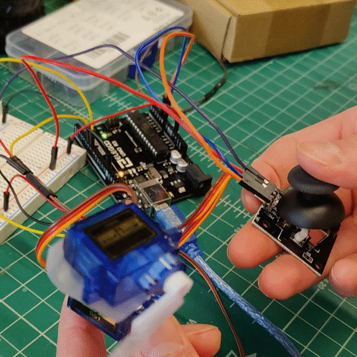
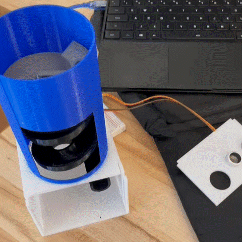
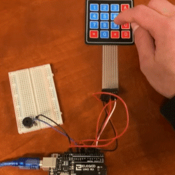

## [About](about)

The purpose of this site is to showcase hands-on engineering projects designed by the Eta-Kappa-Nu (HKN) Outreach program to be taught at K-12 schools. The lessons below contain step-by-step instructions for completing each project, along with a list of required materials, and a bit about how each project works. 

[Read more about HKN Outreach](about). 

## Our Projects

    

      <a href="projects/joystick-servo-gimbal">
        Simple Robotic Arm
        
      </a>
      
In this project students will build a servo gimbal built out of two servos attached together, controlled by a
        two-axis joystick and using an Arduino.

    

    

      <a href="projects/candy-dispenser">
        Candy Dispenser
        
      </a>
      
Students will build a motion activated candy dispenser using an ultrasonic sensor and an Arduino Nano.

    

    

      <a href="projects/musical-keyboard">
        Musical Keyboard
        
      </a>
      
Student will build and program a musical keyboard using an Arduino, a keypad, and a buzzer.

    

