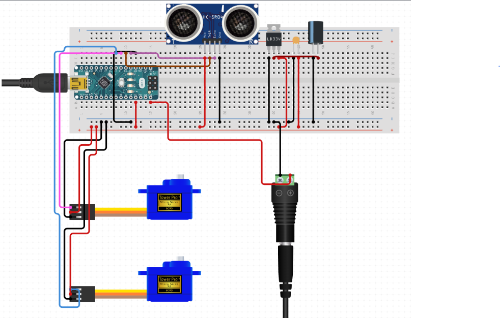

# Candy Dispenser

## Electronics Instructions

[Lesson Slides](https://docs.google.com/presentation/d/1gMUBQHTuppBXgvps0FpxjrCzLTyeFV_O7UgtZworj2M/edit?usp=sharing)

[Arduino Code](https://docs.google.com/document/d/1jGrgNw226EMBM-GMMv10Wqkjf-g7eO3Q8fcVcpR_Sto/edit?usp=sharing)

These are the instructions for assembling the electronic parts for the automatic candy dispenser. At completion, your setup will be able to automatically trigger a servo motor to move when an object (hand) is detected in front of the ultrasonic sensor.

## Parts
* Arduino Nano
* 2 Servo Motors
* Ultrasonic sensor
* 4 Male to Female Wires
* 6 Male to Male Wires
* Breadboard

## Hardware setup



Signal wires should be connected to the following pins

| Part Pin | Arduino Pin |
| ---| --|
| Ultrasonic Sensor Trig | 2 |
| Ultrasonc Sensor Echo | 3 |
| Servo Signal | 5|

## Arduino Code
```c
#include <Servo.h>
const int trigPin = 2; // Defines the pin for the ultrasonic sensor trigger
const int echoPin = 3; // Defines the pin for the ultrasonic sensor echo
Servo myServo;

//runs once at the start 
void setup() {
  Serial.begin(9600); // Initializes the Serial communication at 9600 bits per second
  myServo.attach(5); // Attaches the servo to pin 5
  pinMode(trigPin, OUTPUT); // Sets the ultrasonic sensor trigger pin as output
  pinMode(echoPin, INPUT); // Sets the ultrasonic sensor echo pin as input
}

//continuously loops after running setup()
void loop() {
  long duration, distance; // Defines variables for the ultrasonic sensor

  // Sends a pulse to the ultrasonic sensor trigger pin
  digitalWrite(trigPin, LOW);
  delayMicroseconds(2);
  digitalWrite(trigPin, HIGH);
  delayMicroseconds(10);
  digitalWrite(____, ____); // TODO: fill in the blank here 

  // Reads the duration of the ultrasonic sensor echo pin
  duration = pulseIN(____, ____); // TODO: fill in the blank here 

  // Calculates the distance based on the duration and the speed of sound
  distance = duration / 2 / 29.1;

  // Moves the servo motor based on the distance measured
  if (distance <= 10 && distance >= 0.5) {
    myServo.write(60);
    delay(500); // Delays half a second or 500ms
    myServo.write(90);
    delay(500); // Delays half a second or 500ms
  }
  else {
    myServo.write(90);
  }

  // Sends the distance to the Serial Monitor
  Serial.print("Distance: ");
  Serial.print(distance);
  Serial.println(" cm");

  delay(50); // Waits for 1 second before measuring the distance again
}
```
