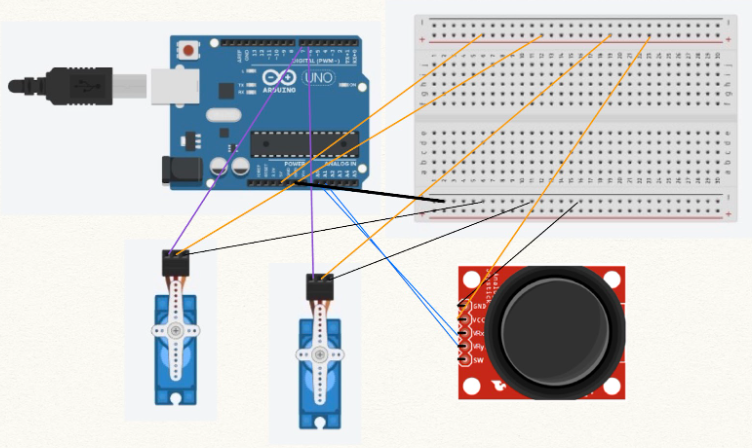

# Simple Arduino Robotic Arm  

## Introduction

In this project, you will learn how to build a simple robotic arm using two servo motors, a joystick, and an Arduino UNO.  

<div style="text-align:center">
    
</div>

## Materials
- Arduino UNO
- 2 Servo motors
- 1 Joystick
- Breadboard
- Wires

## Assembly 

First, assemble your circuit in the following manner. You can use the circuit diagram and/or the netlist below. 

<div style="text-align:center">
    
    
</div>

## Program

Here, is the code for the program that you need to use. Make sure to copy-paste this code exactly as is into your Arduino Editor (you can see specific instructions on using the online Arduino Editor [here](https://docs.google.com/presentation/d/1xa9ZR1YFZFCqHjDvDPaTW2a0bgnuqINdz9AKl5xNVlo/edit?usp=sharing)). 

It's your job to fill out the blanks in the code (make sure to delete all the underscores before you run the program!). 

<details><summary style="user-select: none; cursor: pointer;">Stuck? Click here for a hint</summary>
    The variables joyX, joyY, and swPin are variables that refer to the pin numbers that these components are connected to on the Arduino. A similar reasoning can be used for the last two blanks!
</details>

<br>

```c
#include <Servo.h>

//TODO: FILL IN THE BLANKS
int joyX = __; //pin for x-axis joystick
int joyY = __; //pin for y-axis joystick
int swPin = __; 

int xVal = 0;
int yVal = 0;
int sw = 0;

Servo servoX;
Servo servoY;

void setup() {
  // put your setup code here, to run once:

  Serial.begin(9600);
 
  servoX.attach(__); //TODO: FILL IN THE BLANK
  servoY.attach(__); //TODO: FILL IN THE BLANK

  pinMode(joyX, INPUT);
  pinMode(joyY, INPUT);
  pinMode(swPin, INPUT_PULLUP);
}

void loop() {
  // put your main code here, to run repeatedly: 
  xVal = analogRead(joyX);
  yVal = analogRead(joyY);

  xVal = map(xVal,0,1023,0,180);
  yVal = map(yVal,0,1023,0,180);

  servoX.write(xVal);
  servoY.write(yVal);
}
```

## Resources

- [Lesson Slides](https://docs.google.com/presentation/d/1xa9ZR1YFZFCqHjDvDPaTW2a0bgnuqINdz9AKl5xNVlo/edit?usp=sharing)
- [Documentation](https://docs.google.com/document/d/1TtQ4Z0I49ltHY8hGXvlrVdRJ5D9QkAirXSdvRepRYe0/edit?usp=sharing)


